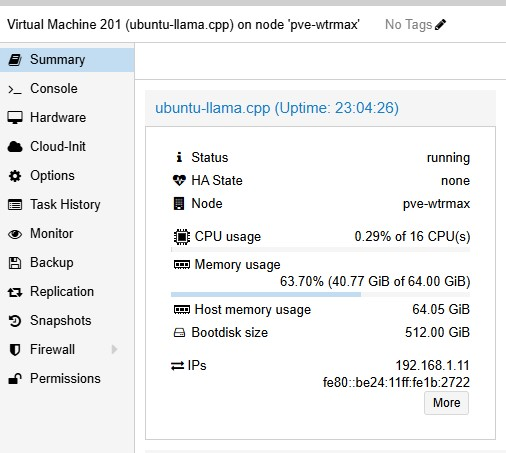
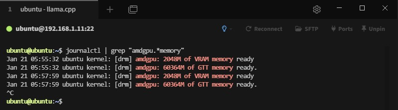

# Issue
AMD 8845HS internal GPU can use RAM as VRAM, but the linux kernel by default will only allocate **50%** of total RAM due to safety concern.

This is too conservative and a waste of RAM *just* sitting there.

We would like to find a balance between **system stability** and **utilization** of the RAM.

# Before We Start


Calculate maximum RAM you want to used as VRAM

Typically we keep **8GB** RAM as system RAM to keep it stable, you can adjust based on your needs.

So in this case

$$64GB - 8GB = 56GB$$

# Execution

## Calculate setting value
$$([size~in~GB] * 1024 * 1024) / 4.096$$

## Update grub

1. open grub in editor
```bash
sudo nano /etc/default/grub
```

2. update `GRUB_CMDLINE_LINUX_DEFAULT`
```bash
GRUB_CMDLINE_LINUX_DEFAULT="amdttm.pages_limit=<setting_value> amdttm.page_pool_size=<setting_value>"
```

3. update grub
```bash
sudo update-grub
```

4. reboot machine
```bash
sudo reboot now
```

5. validate VRAM
```bash
sudo dmesg | grep -E "amdgpu: .*VRAM|amdgpu: .*GTT"
```
You should see something like this (my dmesg log has be cleared out, use `journalctl` instead)


# Final
Now you have 

$$ 2GB + 58GB = 60GB$$

of usable VRAM

you can use it to run large LLM model, or run multiple LLM model, etc

# Reference
- [Increasing the VRAM allocation on AMD AI APUs under Linux](https://www.jeffgeerling.com/blog/2025/increasing-vram-allocation-on-amd-ai-apus-under-linux/)